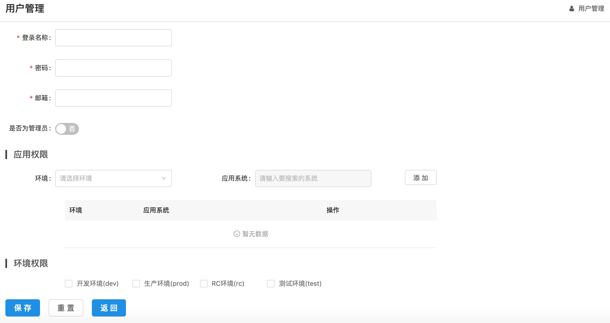
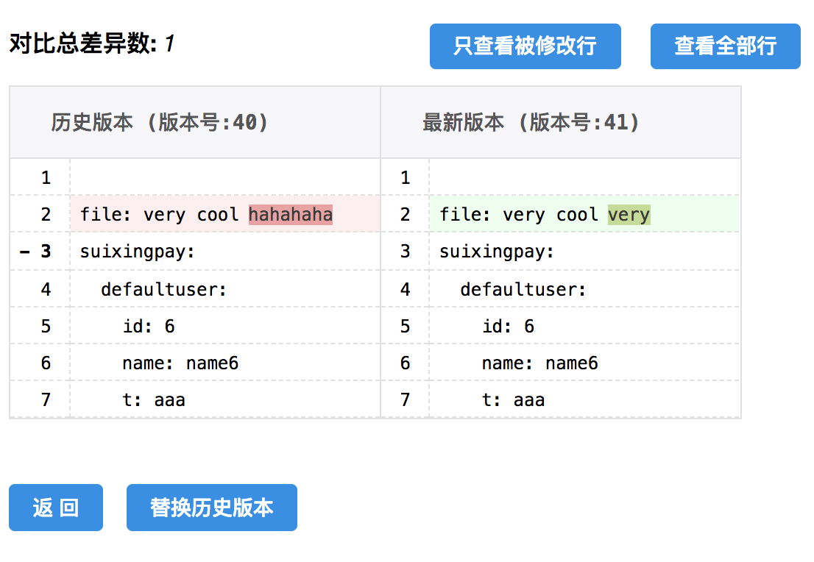
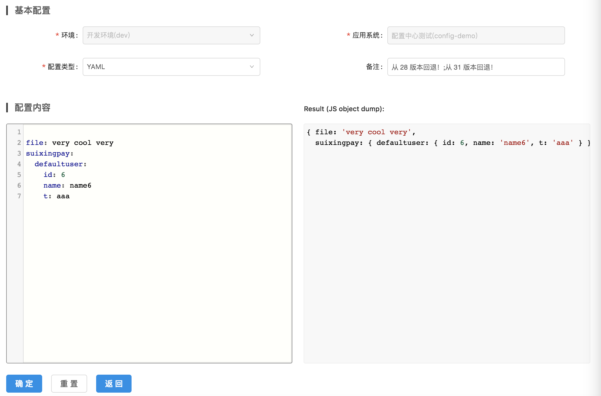
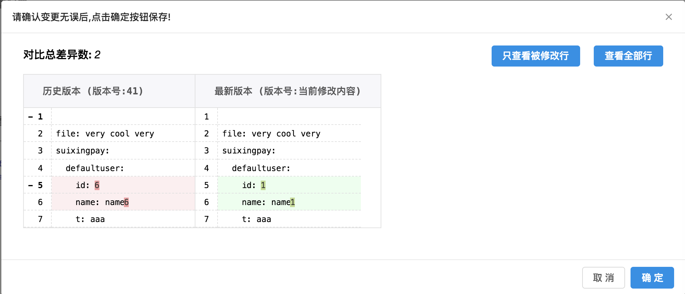

# 金融科技微服务必备神器——配置中心ConfigKeeper开源啦！

在微服务架构中，配置中心是个必不可少的基础服务。应用部署到生产环境后，由于各种原因，需要调整一些配置。如果每次修改配置都需要经过修改代码、重新打包、重新部署等过程，为了避免重新部署造成请求错误，还需要将应用从负载均衡中下线，部署成功后再重新上线，当部署的实例比较多的情况下，那就会严重影响投产效率，如果是为了解决生产上的问题而调整配置，那么这个过程耗时越多，带来的风险也就越大。所以我们需要在不停机、不重新打包、不重新部署的情况下，可以动态修改配置(比如：功能开关、性能参数等)。为了方便动态更新应用配置，需要把配置放到应用执行包之外的配置中心。配置文件不需要打进应用执行包中后，可以带来以下几个好处：一个可执行包就可以在不同的环境下运行，可以降低包的版本管理成本，也可以降低docker镜像的版本管理成本。

Spring cloud 虽然已经为我们提供了基于git或mongodb等实现的配置中心，但是这些方案实现都过于简单，没有达到实际可用的标准，比如：没有提供统一的管理页面，不便于操作和使用；没有权限管理功能；没有数据验证功能等等。但Spring cloud config的核心技术还是可以为我们所有，没有必要重新造轮子。

ConfigKeeper 是由随行付架构部基于Spring Cloud研发的分布式配置中心。基于Spring Cloud开发。与Spring Boot、Spring Cloud应用无缝兼容。下面我们将详细介绍ConfigKeeper配置中心(有图有真像)：

## 1. 支持权限管理，保证数据的安全

下图为用户管理及权限设置界面的截图：

角色设计比较简单，只有管理员和普通用户两种，管理员拥有最高权限，而普通用户只能查看和操作为其分配的配置，以保证数据的安全。

## 2. 支持多环境部署，也支持多环境配置集中管理

企业可以根据自身的情况设置不同的环境，比如：测试、rc以及生产环境。可以多环境共用一个配置中心，也可以每个环境单独使用一个配置中心，根据企业需求灵活部署。

## 3. 配置管理简单实用

为了避免配置内容耦合问题，我们只设计了全局配置（global config）和应用配置(application config)两种类型的配置，并没有设计”组配置“。全局配置是指某一环境下所有应用都能生效的配置，但它的优先及低于应用配置，一个运行环境下有且只有一个全局配置。如果应用可执行包已经有相同的配置，那么会被配置中心的配置所覆盖。

全局配置列表：

应用配置列表：

### 3.1 自带版本管理功能：自动生成版本号以及回退功能

配置内容每修改一次，版本号会自动增加1，同时会将原来配置内容备份到历史表中，以便于查看变更记录和回退。

点击“对比”可以当前版本与最新版本进行比较，非常容易看出版本之间的差异部分，就好像使用git等版本管理工具一样：

通过替换历史版本功能，进行回退。

### 3.2 使用Yml在线编辑器，能实时检查配置格式是否正确；

为了更好管理配置内容，我们使用YAML格式管理配置内容。

使用Yml在线编辑器，可以非常方便编辑，比如：复制粘贴内容，就像在修改配置文件一样。当用户编辑内容时，会实时检查格式是否符合yaml格式时，如果格式是正确的，右则会正确显示其对应的json内容，如果格式不正确则，右则会提示相应的错误信息，能及时发现错误。

### 3.3 支持修改前后内容对比功能，保证修改内容的正确性

在保存修改内容之前会弹出此对比界面，方便确认核对此次变更的内容是否正确，确认无误后再点击“确定”按钮保存。

## 4. 客户端使用简单并兼容Spring Boot和Spring Cloud应用

配置中心提供http接口拉取配置，所以只要支持http协议的应用都是可以使用的。我们已经实现了Spring Boot和Spring Cloud应用的客户端，接下来说明其一些特性及使用方法。

### 4.1 无缝兼容Spring boot、Spring Cloud应用

suixingpay-config-client 是基于spring-cloud开发的，所以使用方法与spring-cloud-config完全一样。支持xml、Spring boot @Value、@ConfigurationProperties 注入配置，支持通过Environment获取配置。支持 spring-cloud 的 @RefreshScope 注解刷新配置。

只需要在项目是加入suixingpay-config-client依赖，并在bootstrap.yml文件中增加如下配置：

    spring:
      application:
        name: config-demo # 设置应用名称，这是必填项
    
      profiles:
        active: ${profile:dev}

    #多环境区分配置
    ---
    spring:
       profiles: test
    suixingpay:
      config:
        enabled: true                  # 是否启用配置中心，默认值为：true;为了方便开发，建议开发环境设置为false
        profile: test                  # 环境名称，默认值为spring.profiles.active的第1个值
        uris:
        - http://127.0.0.1:8080/       # 配置中心服务地址，必须配置
        username: admin                # 调用接口用户名(非配置中心登录的用户名和密码)
        password: 123456               # 调用接口密码
        cachePath: ./config            # 配置缓存路径，默认值为：./config
        cacheTimeOut: 0                # 本地缓存过期时间(单位：秒),如果小于等于0时，一直有效
        failFast: false                # 是否快速失败，如果为true时，当访问配置中心时立即抛异常；如果为false时，会尝试加载3次，并会尝试获取本地缓存，最终还没有配置，才会抛异常。默认值：false
        
下面举个Spring xml文件中获取读取配置值的例子：

    <?xml version="1.0" encoding="UTF-8"?>
    <beans>
    
        <dubbo:application name="${spring.application.name}" />
        <dubbo:registry protocol="${dubbo.registryProtocol}" address="${dubbo.zookeeperAddress}" />
        <dubbo:protocol name="${dubbo.protocolName}" port="${dubbo.protocolPort}" />
        ... ...

    </beans>

关于@Value、@ConfigurationProperties及@RefreshScope的使用就不再一一举例子，更多内容可以参考Spring 官方文档。
### 4.3 支持灰度发布

为了支持灰度发布，suixingpay-config-client并实现没有自动刷新配置的功能，而是通过使用Spring cloud提供的refresh endpoint进行手动刷新，因为当配置变更后，没有经过验证就将最新配置推送给所有应用，风险是非常之大的。正确的做法是，修改配置内容后，先将最新配置内容刷新到一个应用实例进行验证，验证无误后，再刷新剩余的应用。

现有版本还没有方便刷新配置的相关工具，需要借助curl或postmain等工具来完成，我们正在开发相应的功能来提升这块的用户体验，大家可以关注github中的更新。

### 4.4 支持客户端缓存，即使配置中心服务不可用，也不会影响应用的启动

客户端从配置中心获取最新配置后，会缓存到本地磁盘中，应用启动时，先获取本地缓存中的配置版本号，发送给配置中心，如果客户端版本号与服务端的不一致时，才会拉取最新配置，否则返回304状态，并使用本地缓存，通过这个机制可以节约网络带宽，从而也提升一点性能；同时我们还提供 configversion endpoint 用于查看当前应用配置的本地缓存版本信息，通过它也很容易检查客户端的配置的版本与服务端的版本是否一致，能方便发现配置是否更新成功。

我们还可以使用spring boot提供的env及configprops endpoint 查看配置内容，检查配置是否生效、是否正确。

Spring 生态功能非常丰富，为我们解决了非常多棘手问题，但很多东西要进行本地化开发后才能更好的使用。此配置中心使用了不少开源技术，给我们带来了不少便利，希望通过此开源项目回馈社区，为开源社区贡献绵薄之力。希望了解随行付更多开源项目请查看[https://github.com/sxfad](https://github.com/sxfad)和[https://gitee.com/sxfad](https://gitee.com/sxfad)。

ConfigKeeper交流群:478814745
